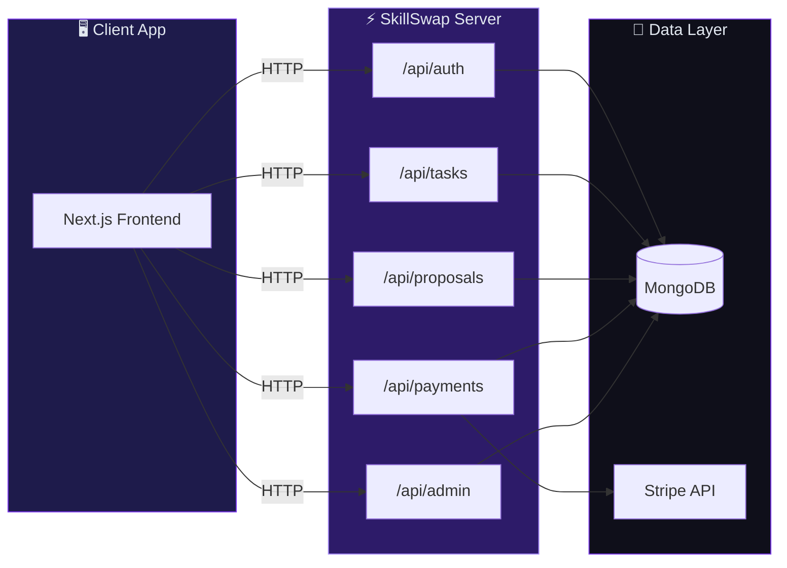

<div align="center">

<!-- Animated SVG Banner -->
<svg xmlns="http://www.w3.org/2000/svg" viewBox="0 0 800 200" width="100%" style="max-width:800px">
  <defs>
    <linearGradient id="srvBg" x1="0%" y1="0%" x2="100%" y2="100%">
      <stop offset="0%" style="stop-color:#0a0a14">
        <animate attributeName="stop-color" values="#0a0a14;#150a28;#0a0a14" dur="7s" repeatCount="indefinite"/>
      </stop>
      <stop offset="50%" style="stop-color:#1e1035">
        <animate attributeName="stop-color" values="#1e1035;#3b1a6e;#1e1035" dur="7s" repeatCount="indefinite"/>
      </stop>
      <stop offset="100%" style="stop-color:#0a0a14">
        <animate attributeName="stop-color" values="#0a0a14;#12082a;#0a0a14" dur="7s" repeatCount="indefinite"/>
      </stop>
    </linearGradient>
    <linearGradient id="srvText" x1="0%" y1="0%" x2="100%" y2="0%">
      <stop offset="0%" style="stop-color:#c4b5fd"/>
      <stop offset="50%" style="stop-color:#7C3AED"/>
      <stop offset="100%" style="stop-color:#a78bfa"/>
    </linearGradient>
    <filter id="srvGlow">
      <feGaussianBlur stdDeviation="4" result="blur"/>
      <feMerge><feMergeNode in="blur"/><feMergeNode in="SourceGraphic"/></feMerge>
    </filter>
  </defs>
  <rect width="800" height="200" rx="16" fill="url(#srvBg)"/>
  <!-- API pulse rings -->
  <circle cx="400" cy="100" r="70" fill="none" stroke="#7C3AED" stroke-width="1" opacity="0.3">
    <animate attributeName="r" values="70;90;70" dur="3s" repeatCount="indefinite"/>
    <animate attributeName="opacity" values="0.3;0.1;0.3" dur="3s" repeatCount="indefinite"/>
  </circle>
  <circle cx="400" cy="100" r="50" fill="none" stroke="#a78bfa" stroke-width="1" opacity="0.4">
    <animate attributeName="r" values="50;65;50" dur="2.5s" repeatCount="indefinite"/>
    <animate attributeName="opacity" values="0.4;0.15;0.4" dur="2.5s" repeatCount="indefinite"/>
  </circle>
  <!-- Server icon -->
  <g transform="translate(365, 65)" filter="url(#srvGlow)">
    <rect x="0" y="0" width="70" height="45" rx="8" fill="#1e1b4b" stroke="#7C3AED" stroke-width="2"/>
    <rect x="10" y="10" width="50" height="6" rx="2" fill="#7C3AED" opacity="0.8">
      <animate attributeName="opacity" values="0.8;1;0.8" dur="1.5s" repeatCount="indefinite"/>
    </rect>
    <rect x="10" y="22" width="35" height="4" rx="1" fill="#a78bfa" opacity="0.6"/>
    <rect x="10" y="30" width="45" height="4" rx="1" fill="#a78bfa" opacity="0.4"/>
    <circle cx="58" cy="13" r="3" fill="#22c55e">
      <animate attributeName="opacity" values="1;0.4;1" dur="1s" repeatCount="indefinite"/>
    </circle>
  </g>
  <text x="400" y="145" text-anchor="middle" fill="url(#srvText)" font-size="36" font-weight="bold" font-family="sans-serif" filter="url(#srvGlow)">SkillSwap API</text>
  <text x="400" y="175" text-anchor="middle" fill="#64748b" font-size="13" font-family="monospace" letter-spacing="3">NEXT.JS · MONGODB · STRIPE · BETTER AUTH</text>
</svg>

<br/>

[](https://github.com/fahimuntasin/skillswap-client)
[](https://skillswap-two-psi.vercel.app)

<br/>

[](https://nextjs.org)
[](https://www.typescriptlang.org)
[](https://www.mongodb.com)
[](https://mongoosejs.com)
[](https://stripe.com)
[](https://www.better-auth.com)

<br/>

<!-- Typing SVG -->
[](https://git.io/typing-svg)

</div>

---

## ⚡ About

The **SkillSwap Server** is the backend API powering the [SkillSwap](https://skillswap-two-psi.vercel.app) freelance marketplace. Built with **Next.js API Routes**, it handles authentication, task management, proposals, Stripe payments, reviews, and admin operations — all backed by **MongoDB**.

> 🔌 Pairs with the [skillswap-client](https://github.com/fahimuntasin/skillswap-client) frontend repository.

---

## 🌟 API Capabilities

<table>
<tr>
<td width="50%">

### 🔐 Auth (`/api/auth/*`)
- Better Auth handler (email + Google OAuth)
- Session management & role assignment
- MongoDB adapter for user storage

### 📋 Tasks (`/api/tasks`)
- CRUD with pagination (`?page=1&limit=9`)
- Search & category filtering
- Task completion + deliverable submission

### 📝 Proposals (`/api/proposals`)
- Freelancers submit proposals
- Clients accept/reject applications
- Status tracking per task

</td>
<td width="50%">

### 💳 Payments (`/api/payments`)
- Stripe Checkout session creation
- Payment confirmation via session ID
- Transaction history & revenue tracking

### 👤 Users & Admin
- User listing, blocking/unblocking
- Freelancer profiles with ratings
- Admin revenue analytics & cascade deletes

### 📊 Platform
- `/api/stats` — live platform statistics
- `/api/health` — health check endpoint
- `/api/reviews` — star ratings & comments
- `/api/notifications` — user notifications

</td>
</tr>
</table>

---

## 🏗️ System Architecture



---

## 📡 API Endpoints

<details>
<summary><b>🔐 Authentication</b></summary>

| Method | Path | Description |
|--------|------|-------------|
| `ALL` | `/api/auth/*` | BetterAuth handler (login, register, OAuth) |
| `GET` | `/api/auth/session` | Get current session |

</details>

<details>
<summary><b>📋 Tasks</b></summary>

| Method | Path | Description |
|--------|------|-------------|
| `GET` | `/api/tasks?page=1&limit=9` | List open tasks (paginated) |
| `GET` | `/api/tasks/:id` | Get single task |
| `POST` | `/api/tasks` | Create task |
| `PUT` | `/api/tasks?id=xxx` | Update task |
| `DELETE` | `/api/tasks?id=xxx` | Delete task |
| `PATCH` | `/api/tasks/complete?id=xxx` | Complete task + deliverable |

</details>

<details>
<summary><b>📝 Proposals</b></summary>

| Method | Path | Description |
|--------|------|-------------|
| `GET` | `/api/proposals?task_id=xxx` | List proposals for a task |
| `POST` | `/api/proposals` | Submit proposal |
| `PATCH` | `/api/proposals?id=xxx` | Accept/reject proposal |

</details>

<details>
<summary><b>💳 Payments</b></summary>

| Method | Path | Description |
|--------|------|-------------|
| `POST` | `/api/payments` | Create Stripe checkout session |
| `PUT` | `/api/payments?session_id=xxx` | Confirm payment |
| `GET` | `/api/payments` | List all payments |

</details>

<details>
<summary><b>👤 Users, Freelancers & Admin</b></summary>

| Method | Path | Description |
|--------|------|-------------|
| `GET` | `/api/users?role=freelancer` | List users by role |
| `PATCH` | `/api/users?id=xxx` | Block/unblock user |
| `GET` | `/api/freelancers?limit=10` | Top freelancers with ratings |
| `GET` | `/api/earnings?email=xxx` | Freelancer earnings |
| `GET` | `/api/client-tasks?client_email=xxx` | Client's posted tasks |
| `DELETE` | `/api/admin/tasks?id=xxx` | Admin delete task (cascade) |
| `GET` | `/api/admin/revenue` | Revenue analytics |
| `PATCH` | `/api/admin/users?id=xxx` | Admin block/unblock |

</details>

<details>
<summary><b>📊 Other</b></summary>

| Method | Path | Description |
|--------|------|-------------|
| `GET` | `/api/stats` | Platform statistics |
| `GET` | `/api/health` | Health check |
| `GET` | `/api/reviews` | Get reviews |
| `POST` | `/api/reviews` | Create review |
| `GET` | `/api/notifications` | User notifications |

</details>

---

## 🗄️ Database Models

```
┌─────────────┐     ┌─────────────┐     ┌──────────────┐
│    users    │     │    tasks    │     │  proposals   │
├─────────────┤     ├─────────────┤     ├──────────────┤
│ name        │     │ title       │     │ task_id      │
│ email       │     │ category    │     │ freelancer   │
│ role        │     │ budget      │     │ budget       │
│ skills      │     │ deadline    │     │ est. days    │
│ bio         │     │ status      │     │ status       │
│ isBlocked   │     │ client_email│     └──────────────┘
└─────────────┘     └─────────────┘
                           │
              ┌────────────┼────────────┐
              ▼            ▼            ▼
       ┌──────────┐ ┌──────────┐ ┌──────────┐
       │ payments │ │ reviews  │ │notifica- │
       │          │ │          │ │  tions   │
       └──────────┘ └──────────┘ └──────────┘
```

| Collection | Key Fields |
|-----------|-----------|
| **users** | name, email, image, role, skills, bio, isBlocked |
| **tasks** | title, category, description, budget, deadline, client_email, status |
| **proposals** | task_id, freelancer_email, proposed_budget, estimated_days, status |
| **payments** | client_email, freelancer_email, task_id, amount, transaction_id |
| **reviews** | task_id, reviewer_email, reviewee_email, rating, comment |

---

## 🚀 Getting Started

### Prerequisites

- Node.js 18+
- MongoDB (local or Atlas)
- Stripe test account
- Google OAuth credentials (optional)

### Installation

```bash
# Clone the repository
git clone https://github.com/fahimuntasin/skillswap-server.git
cd skillswap-server

# Install dependencies
npm install

# Configure environment
cp .env.example .env.local
# Edit .env.local with your credentials

# Seed database with sample data
npx tsx src/scripts/seed.ts

# Start development server (port 3001)
npm run dev
```

### Environment Variables

| Variable | Description |
|----------|-------------|
| `MONGODB_URI` | MongoDB connection string |
| `BETTER_AUTH_SECRET` | Random secret for auth sessions |
| `BETTER_AUTH_URL` | Server URL (e.g. `http://localhost:3001`) |
| `GOOGLE_CLIENT_ID` | Google OAuth client ID |
| `GOOGLE_CLIENT_SECRET` | Google OAuth client secret |
| `STRIPE_SECRET_KEY` | Stripe secret key |

> ⚠️ Never commit `.env.local`. Use `.env.example` as a template only.

---

## 🧪 Seed Data

```bash
npx tsx src/scripts/seed.ts
```

Creates:
- Admin user (`admin1@taskhive.com`)
- Sample freelancers & clients
- Demo tasks with proposals

---

## 📁 Project Structure

```
skillswap-server/
├── src/
│   ├── app/
│   │   └── api/
│   │       ├── auth/          # Better Auth routes
│   │       ├── tasks/         # Task CRUD + complete
│   │       ├── proposals/     # Proposal management
│   │       ├── payments/      # Stripe integration
│   │       ├── users/         # User management
│   │       ├── freelancers/   # Freelancer profiles
│   │       ├── reviews/       # Ratings & reviews
│   │       ├── admin/         # Admin operations
│   │       ├── stats/         # Platform statistics
│   │       └── health/        # Health check
│   ├── lib/                   # DB models, auth config
│   └── scripts/               # Seed scripts
└── .env.example               # Environment template
```

---

## 📊 GitHub Stats

<div align="center">


</div>

---

## 🔗 Links

| Resource | URL |
|----------|-----|
| 🌐 **Live App** | [skillswap-two-psi.vercel.app](https://skillswap-two-psi.vercel.app) |
| 🖥️ **Frontend Repo** | [github.com/fahimuntasin/skillswap-client](https://github.com/fahimuntasin/skillswap-client) |
| 📋 **Assignment** | A10_CAT-011 — Freelance Micro-Task Platform |

---

<div align="center">

**API built with 💜 — Next.js · MongoDB · Better Auth · Stripe**

<sub>SkillSwap Server © 2026 · Backend for the SkillSwap marketplace</sub>

</div>
